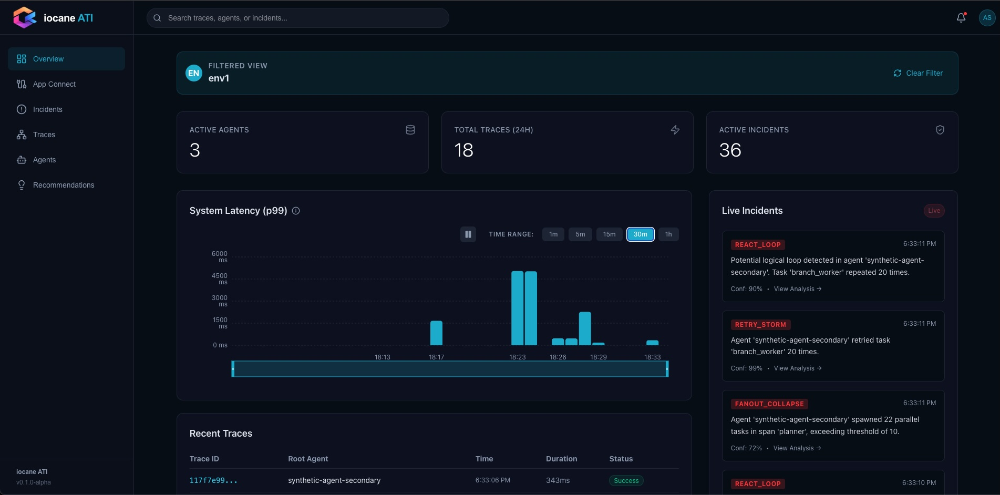
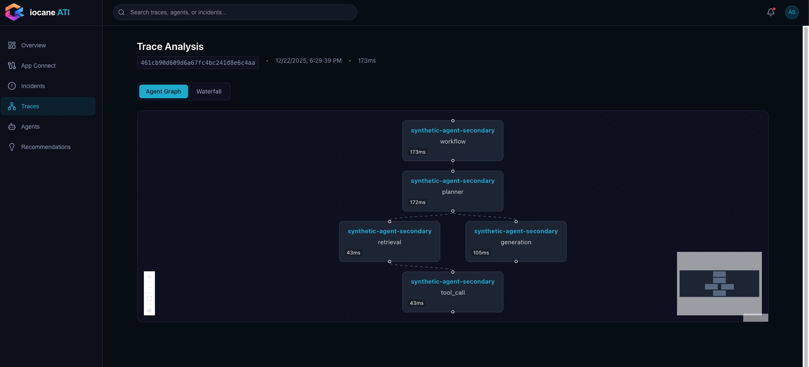
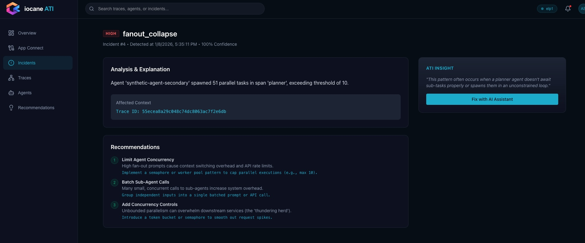

# ATI Integrations

OpenTelemetry-based instrumentation SDK and framework integrations for **iocane ATI**.
These integrations capture agent execution flows (LLM calls, tool usage, steps, orchestration) and emit them as standard OTLP traces with standard semantic attributes.





## 🚀 Getting Started

Follow these steps to generate your API keys and connect your agent environment.

### 1. Install the CLI

**Mac / Linux**:
```bash
curl -fsSL https://iocane.ai/install.sh | sh
```

**Windows (PowerShell)**:
```powershell
irm https://iocane.ai/install.ps1 | iex
```

### 2. Authenticate & Connect

1.  **Login**:
* Make sure you are logged in to your iocane account on our default browser

    ```bash
    iocane login
    ```
2.  **Connect Environment**:
    Run this in your project root to generate keys and start the local collector:
    ```bash
    iocane connect --env "my-agent-project"
    ```
    This creates a `.env.iocane` file containing your `IOCANE_API_KEY` and `IOCANE_ENV_ID`.

## 📦 Packages

| Package | Framework | Status | Description |
|---------|-----------|--------|-------------|
| [`ati-sdk`](sdk/) | - | Stable | Shared config & semantic conventions |
| [`ati-integrations-langchain`](integrations/langchain/) | LangChain | Stable | Callback-based instrumentation |
| [`ati-integrations-crewai`](integrations/crewai/) | CrewAI | Stable | Hook-based instrumentation for Crew/Agent |
| [`ati-integrations-autogen`](integrations/autogen/) | AutoGen | Stable | Middleware for Chat Agents |
| [`ati-integrations-llamaindex`](integrations/llamaindex/) | LlamaIndex | Stable | Callback handler for RAG/Agents |
| [`ati-integrations-autogpt`](integrations/autogpt/) | AutoGPT | Stable | Agent loop instrumentation |

## ⚙️ Configuration

Point your agent's OpenTelemetry SDK to the local collector (started by `iocane connect`) or directly to the API.

### Option A: Local Collector (Recommended)
The local collector listens on standard OTLP ports: `4317` (gRPC) and `4318` (HTTP).

**Python/Go/Java (gRPC Default)**:
```bash
export OTEL_SERVICE_NAME=my-agent-service
export OTEL_EXPORTER_OTLP_ENDPOINT=http://localhost:4317
```

**Node.js (HTTP Default)**:
```bash
export OTEL_SERVICE_NAME=my-agent-service
export OTEL_EXPORTER_OTLP_ENDPOINT=http://localhost:4318
```

### Option B: Direct Connection
If you cannot run the local collector (Docker), use the credentials from `.env.iocane`:

```bash
# Retrieve keys
source .env.iocane

export OTEL_SERVICE_NAME=my-agent-service
export OTEL_EXPORTER_OTLP_ENDPOINT=https://api.iocane.ai/v1/traces
export OTEL_EXPORTER_OTLP_HEADERS="x-iocane-key=${IOCANE_API_KEY},x-ati-env=${IOCANE_ENV_ID}"
```

## 📚 Documentation

- [Semantic Conventions](docs/semantic-conventions.md)
- [Developer Story](docs/developer-story.md)
- [Integration Contract](docs/integration-contract.md)
